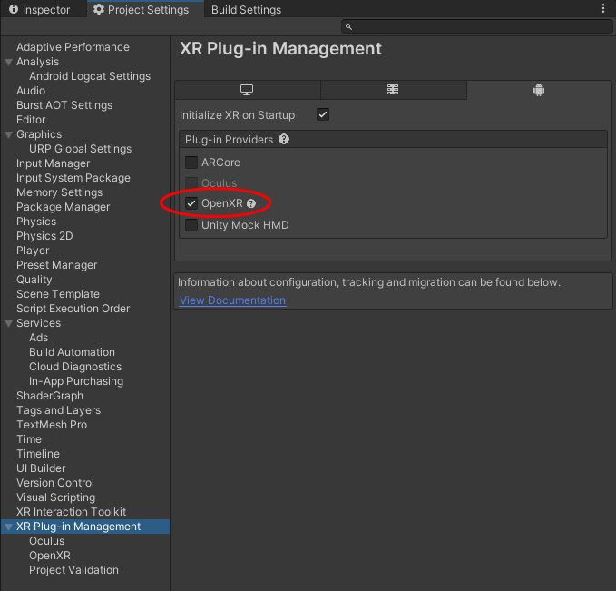
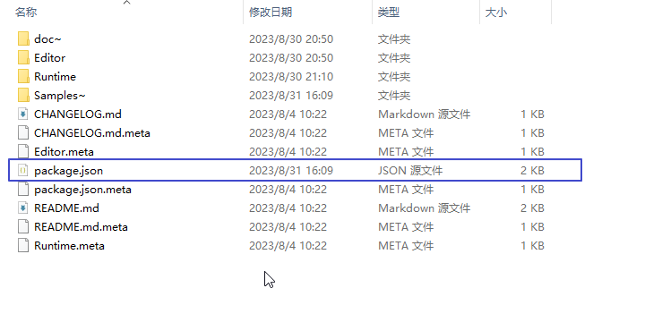
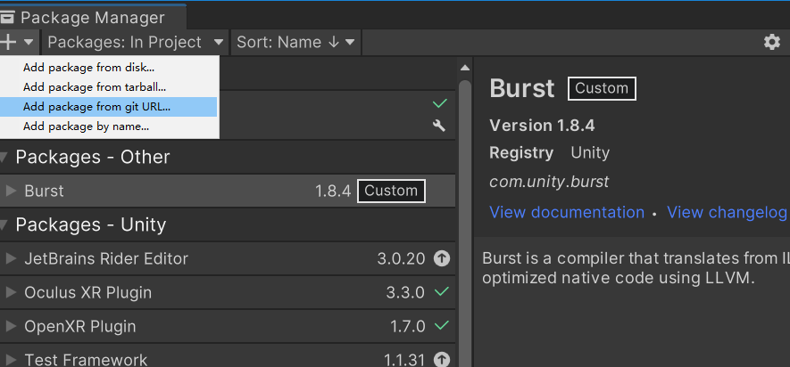
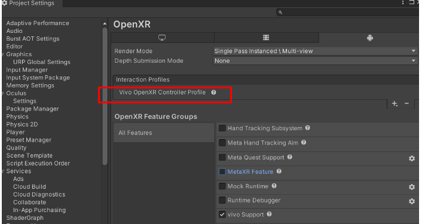
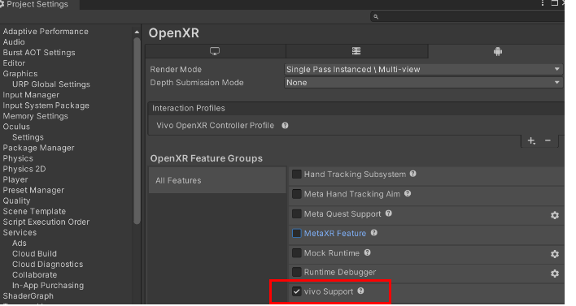

·
# 一，头显配套开发环境说明

## 1，scrcpy投屏工具包

简介：

包含投屏工具和adb工具，启动投屏工具可将头显画面投屏到PC。如使用2D launcher版本的，可在Launcher界面点击APP启动应用；

安装：

* 登录https://github.com/Genymobile/scrcpy/releases/tag/v2.1
* 下载解压scrcpy-win64-v2.1.zip；

使用步骤：

* 使用USB数据将头显与PC连接；
* 打开Windows文件夹，进入scrcpy安装目录，点击scrcpy.exe；

## 2，vivo头显设备

简介：

运行XR应用，支持openxr标准；

系统版本：

* 使用adb工具查看（推荐12.0.2.16及以上）；

查看系统：

* 打开Windows文件夹，进入scrcpy安装目录，在地址栏输入cmd，按回车键，打开命令终端；
* adb shell getprop | findstr version

安装应用：

* 使用鼠标拖拽apk到投屏工具界面中或者使用adb install命令安装；

卸载应用：

* 在12.0.2.33以前使用2D Android Launcher的老系统时，可以在launcher的图标列表投屏界面，鼠标长按，根据提示拖动卸载；
* 在12.0.2.33及以上使用3D XR Launcher的新系统时，可以使用浏览器辅助调试页面进行应用的卸载、启动、退出；
    * 第一步转发端口：adb forward tcp:8081 tcp:8010
    * 第二步浏览器打开：http://localhost:8081

## 3，Controller手柄

简介：

用于XR 射线、按键、震动交互，能力集对齐 Oculus Touch Controller Profile；

状态灯：

* 蓝灯长亮为正常连接，红灯为缺电，灯闪为断开，灯灭为休眠；

连接方式：

* 打开Setting - 手柄设置，装上电池，左手柄同时长按 【菜单键+X键】，右手边同时长按【系统键+A键】，待震动并亮绿灯时点击手柄绑定按钮，可查看版本号为正常；

手柄菜单：

* 在XR应用中，按下手柄的System键，弹出菜单，可以进行退出、截屏等；

# 二，搭建 Vivo XR Plugin 开发环境

## 1，安装 XR Plugin Management，OpenXR Plugin

XR Plugin Manager中勾选启用OpenXR

## 2，安装 Vivo XR Plugin

下载解压sdk包，使用Unity Package Manager，Add from disk，选择package.json

* 内部用户可选Add from git URL，gitUrl：https://gitlab.vmic.xyz/xr_app/vivosdk/vxrunitysdk.git

## 手柄输入配置
* 进入Project Setting -> XR Plug-in Manager -> OpenXR
* 根据提示Fix相关OpenXR导入警告/错误
* 在Interaction Profiles选择 Vivo OpenXR Controller Profile；
<!--  -->

## 3，打包

* 打包在 ProjectSetting/XR Plugin Manager/OpenXR Plugin 面板中选择 Vivo Support

* 如果项目的minSdkVersion设置较低，会提示minSdkVersion cannot be smaller than version 29 declared in labrary[:StickLib-0.1.0.19:]，建议minSdkVersion升到29及以上；
