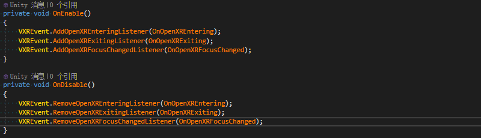
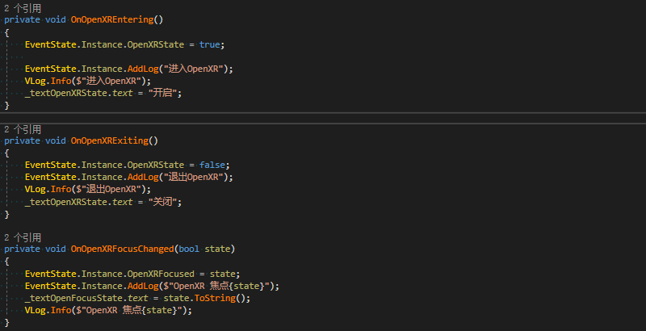
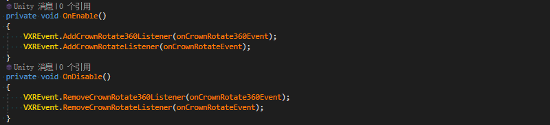
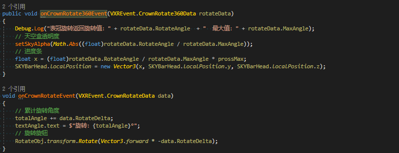

# OpenXR事件
接收OpenXR Native派发的事件,支持进入，退出焦点变化等事件

## 添加事件
开发者可以在脚本中注册OpenXR事件。需要特殊说明的是，OpenXR事件**不同于**Unity Application提供**focusChanged,quitting**等事件。OpenXR事件是由OpenXR Runtime状态发生变化而产生。

**当前支持事件：**
事件注册函数 | 类 | 类型 | 描述
------ | ------ | ------ | ------ 
 AddOpenXREnteringListener | [VXREvent](../../../API/XR/Operation/Event/VXREvent.md)  | void | OpenXR Session进入事件
 AddOpenXRExitingListener | [VXREvent](../../../API/XR/Operation/Event/VXREvent.md)  | void | OpenXR Session退出事件
 AddOpenXRFocusChangedListener | [VXREvent](../../../API/XR/Operation/Event/VXREvent.md)  | void | OpenXR Session焦点变化事件
 RegisterRefresRateChangeEvent | [VXRRefreshRate](../../../API/XR/Operation/RefreshRate/VXRRefreshRate.md)  | vivo | 刷新率发生变化
 

**示例：**  
* 事件的注册和移除：   
  

* 监听回调函数示例：  
    

# 旋转表冠事件
接收来自表冠旋转操作上报的事件。  

## 添加事件
开发者可以在脚本中监听表冠旋转事件，接收来自表冠的旋转数据。

**当前支持事件：**
事件注册函数 | 类 | 静态 | 描述
------ | ------ | ------ | ------ 
 AddCrownRotateListener | [VXREvent](../../../API/XR/Operation/Event/VXREvent.md) | true | 表冠单次旋转事件 事件返回单次旋转变化量 正/负代表旋转方向 - 顺时针为正 - 逆时针为负
 AddCrownRotateListener | [VXREvent](../../../API/XR/Operation/Event/VXREvent.md) | true | 表冠归一化旋转事件 事件返回表冠累计旋转角度 旋转角范围为 -360度 ~ +360度

**示例：**
* 事件的注册和移除：   

* 监听回调函数示例：  
   

  

引用

* [VXREvent](../../../API/XR/Operation/Event/VXREvent.md)
* [VXRRefreshRate](../../../API/XR/Operation/RefreshRate/VXRRefreshRate.md)

