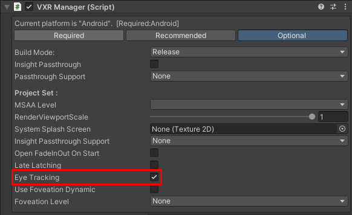
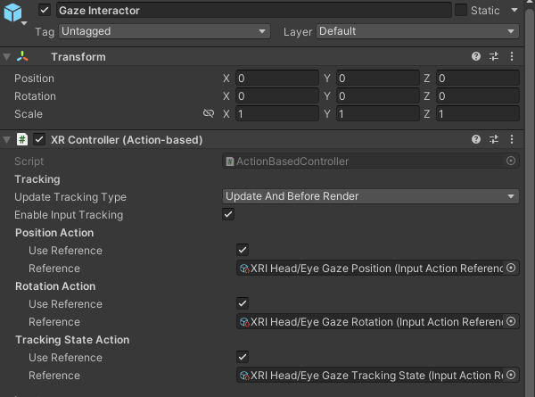

# 眼动追踪

>当前眼动已接入XRI，可按照XRI方式接入眼动交互

### 眼动交互
眼动交互提供了三种配置方式，开发者可以根据项目情况使用。

实现方式 | UI交互 | 物理交互 | 说明
--- | --- | --- | ---
基于XRI配置 | 支持 | 支持 | **推荐** XRI扩展，支持更多交互事件
基于InputSystem配置 | 支持 | 不支持 | UnityXR原生交互方式，仅支持UI交互事件
基于Vivo配置 | 支持 | 不支持 | Vivo私有实现

#### 1.XR Interaction Toolkit的眼动交互配置
**方式一：** AssetsCommon示例中提供了**XRI Origin.prefab**，添加了基础的组件支持。
**方式二：** 参考XRI Origin.prefab 追加以下导入和修改，按照以下步骤手动导入：
* 创建XR Origin组件：GameObject->XR->XR Origin(VR)
* 添加[VXRManager](../../../API/XR/Base/VXRManager.md)组件
   1. 选中XR Origin，在右键菜单中创建空节点CreateEmpty，添加VXRManager组件。
   2. 在Optional标签下，勾选**Eye Tracking**
    
* 添加Gaze Interactor眼动交互器
    1. 选中Camera Offset，在右键菜单中创建交互器 XR->Gaze Interactor(Action-base)
    2. 设置Gaze Interactor节点的XRController(Action-Base)组件，绑定**Position Actioin**、**Rotation Action**和**Tracking State Action**。如下图所示：
    
* 添加XRUIInputModule组件。
   1. 在EventSystem组件所在GameObject中添加XRUIInputModule组件
   2. 绑定XRUIInputModule组件的Input System UI Actions
   

#### 2. 基于InputSystem的眼动交互配置
方式一：AssetsCommon示例中提供了**XR Origin.prefab**，添加了基础的组件支持。
方式二：参考XR Origin.prefab 追加以下导入和修改，按照以下步骤手动导入：
* 添加[VXRManager](../../../API/XR/Base/VXRManager.md)组件
   1. 选中XR Origin，在右键菜单中创建空节点CreateEmpty，添加VXRManager组件。
   2. 在Optional标签下，勾选**Eye Tracking**
    
* 在场景中添加InputAssetEnabler组件，并导入对应ActionMap

<!-- * 在EyeGaze的TrackedPoseDriver组件中设置眼动Action
 -->
* 在EventSystem组件所在GameObject中添加InputSystemUIInputModule组件
* 设置Tracked Position与Tracked Orientation为眼动position,rotation对应Action

#### 3.基于Vivo的眼动交互配置
方式一：AssetsCommon示例中提供了**VXR Origin.prefab**，添加了基础的组件支持。
方式二：参考VXR Origin.prefab 追加以下导入和修改，按照以下步骤手动导入：
<!-- 眼动交互当前支持EventSystem系统[交互事件](https://docs.unity3d.com/2018.3/Documentation/ScriptReference/EventSystems.IPointerExitHandler.html) -->
* 添加[VXRManager](../../../API/XR/Base/VXRManager.md)组件
   1. 在Hierarchy中右键菜单中创建空节点CreateEmpty，添加VXRManager组件。
   2. 在Optional标签下，勾选**Eye Tracking**
    
* 添加VXREyeGaze眼动追踪组件。创建空节点并添加VXREyeGaze组件。
* 添加[VXRInputModule](../../../API/XR/Operation/Interaction/EventSystem/VXRInputModule.md)组件
    1. 在EventSystem节点中添加VXRInputModule 
    2. 勾选AllowActivation On Mobile Devices
    3. 选择Hand参数，设置Click事件触发手柄
    4. 将VXR组件所对应GameObject拖入Ray Transform
    
* 添加Canvas事件触发器[VXRRaycaster](../../../API/XR/Operation/Interaction/EventSystem/VXRRaycaster.md)：在Canvas中添加VXRRaycaster组件,在Inspector面板中设置需要响应事件层级
* 添加Collider事件触发器[VXRPhysicsRaycaster](../../../API/XR/Operation/Interaction/EventSystem/VXRPhysicsRaycaster.md)

## 注意
>当前眼动追踪为内部实验特性,若出现眼动失效，请检查
> - 电量是否低于20%
> - 设备是否支持眼动追踪
><b>若以上情况均已排除，请联系SDK开发者