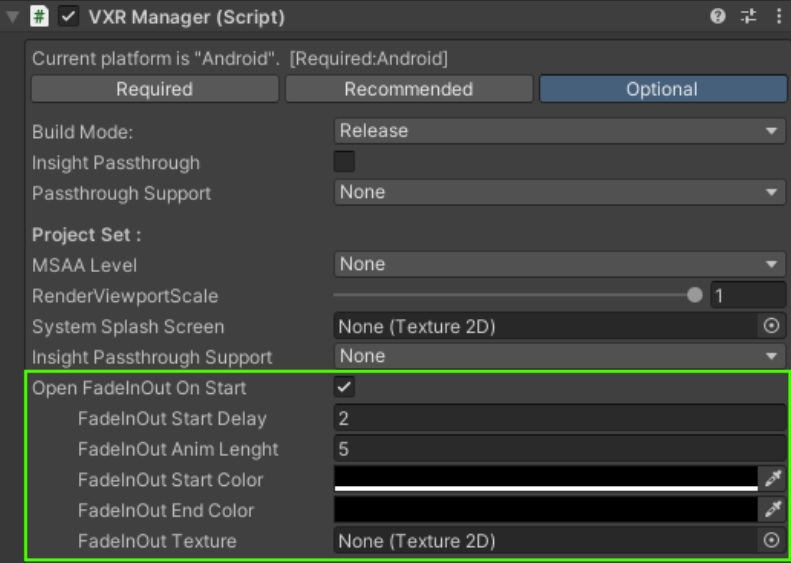

# 1.开启启动时的淡入淡出效果

>> 
需要在VXRManager编辑器界面Inspector上手动打开Open FadeInOut On Start选项。

>> 
名称     | 描述
-------- | -----
FadeInOut Start Delay  |淡入淡出效果出现前的延迟时间（秒），期间屏幕颜色为淡入淡出开始颜色。
FadeInOut Anim Lenght  |淡入淡出效果动画的时间长度（秒）。
FadeInOut Start Color  |淡入淡出效果开始的颜色，A通道标识淡入淡出效果的透明度。
FadeInOut End Color  |淡入淡出效果结束的颜色，A通道标识淡入淡出效果的透明度。
FadeInOut Texture  |淡入淡出效果使用的叠加纹理。

>> 

### 示例

# 2.运行时开启淡入淡出效果

>> 运行时启动淡入淡出效果需要使用接口 VXRCommon.StartFadeInOutAnim()。

### 示例
> VXRCommon.StartFadeInOutAnim(2f, 5f,new Color(0,0,0,1), new Color(0,0,0,0),null);

引用

* [VXRCommon](../../../API/XR/Base/VXRCommon.md)

