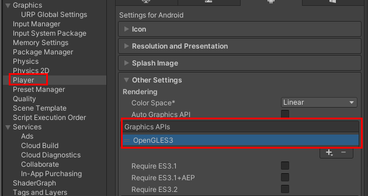
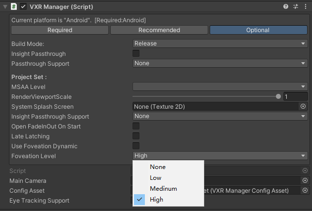

#静态注视点
FFR 使眼睛缓冲区的边缘能够以低于眼睛缓冲区中心部分的分辨率进行渲染。请注意，与某些其他形式的注视点技术不同，FFR 并不基于眼动追踪。相反，高分辨率像素“固定”在眼睛缓冲区的中心。

## 设置FFR级别
有多种方法可以设置 FFR 级别和打开动态注视点。

>TIPS:当前FFR仅支持OpenGL


### 项目设置
* 在Hierarchy中添加VXRManager组件
* VXRManager的Inspector面板中切换至Optional标签页
* 使用Foveation Level设置所需的注视点级别
* 使用 Foveation Dynamic设置动态匹配注视点级别状态


### 设置FFR的API
```CSharp
// 设置注视点级别
VXRFoveationRendering.SetFoveationLevel(FoveationRendering.Level.High);
// 设置动态匹配注视点级别状态
VXRFoveationRendering.SetUseDynamicFoveationLevel(false);
```

### 注意事项
- 注视点渲染在URP下会失效
- 暂不支持Vulkan
- 动态匹配注视点级别（SetUseDynamicFoveationLevel）优先级高于设置注视点级别（SetFoveationLevel）。
  - 当动态匹配注视点级别状态为ture时，设置的注视点级别将会失效。
  - 当动态匹配注视点级别状态为false时，会恢复到之前设置的注视点级别或者默认的注视点级别。

## 引用
* [VXRFoveationRendering](../../../API/XR/Operation/FoveationRendering/FoveationRendering.md)
* [FoveationLevel](../../../API/XR/Operation/FoveationRendering/FoveationLevel.md)