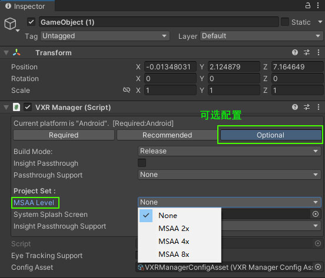

 
    
1.编辑器状态开启MSAA抗锯齿

>> 需要在VXRManager编辑器界面Inspector上选择可选配置栏中的MSAA选项，None为关闭，其他的为开启，对应MSAA开启等级。

# 示例

 
    
2.运行时动态开启MSAA抗锯齿

>> 运行时修改MSAA需要使用接口 VXRCommon.MsaaSample。

# 示例
> 关闭：VXRCommon.MsaaSample = UnityEngine.Rendering.MSAASamples.None;
> 开启：VXRCommon.MsaaSample = UnityEngine.Rendering.MSAASamples.MSAA2x; // MSAA4x  MSAA8x

引用

* [VXRCommon](../../../API/XR/Base/VXRCommon.md)

