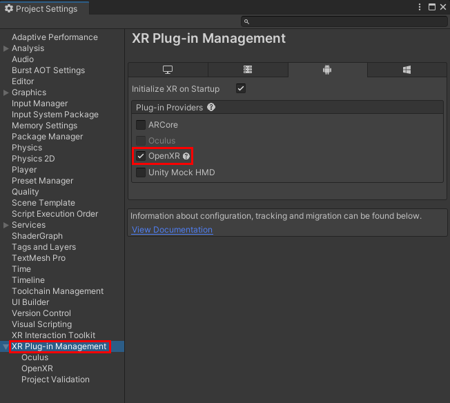

# 合成层

> 合成层可以用来展示场景中的焦点对象，例如信息、文本、视频以及纹理，也可以用来展示简单的场景环境和背景。
> 
> 通常来说，渲染 VR 内容时，左右眼摄像机首先将场景内容渲染到 Eye Buffer 上；绘制完成后，异步时间扭曲线程（Asynchronous Timewarp，ATW）对 Eye Buffer 进行畸变、采样、合成等处理；处理完毕后，场景内容最终被渲染到屏幕上。
>
> 若通过 VR 合成层技术进行场景渲染，则无需将场景内容绘制到 Eye Buffer 上，而是直接透传给 ATW 线程进行畸变、采样、合成等处理。因此，减少了一次额外的纹理采样，简化了整个渲染流程，同时可提升渲染质量。

我们为合成层提供了VXROverlay组件，组件面板如下图：
 

# 注意事项
* 目前，单个场景支持的 VR 合成层数量最多为 15。
* 考虑到对性能的影响，建议单个场景的 VR 合成层数量控制在 4 层左右。
* 当前只支持OpenGLES Graphics API；


# 合成层类型
VXROverlay支持的合成层类型：Overlay、Underlay，具体说明如下
类型 | 描述
------ | ------
 Overlay | 将纹理呈现在 Eye Buffer 前面 
  Underlay | 将纹理呈现在 Eye Buffer 后面 

注意：由于 Underlay 层依赖于渲染目标上的 alpha 通道。场景中的所有对象绘制到 Eye Buffer 后，你需要在 Eye Buffer 上构建一个 “洞”，使 Underlay 纹理透过这个 “洞” 显示出来。你可以在 Packages/Vivo XR Plugin/Assets/Resources/Shaders 目录下获取 UnderlayHole 脚本，然后使用该脚本来构建“洞”，或根据应用需求编写 shader 来构建 “洞”。

 # 合成层深度
合成层用于控制合成层在场景中的顺序，数值越小，越靠近Camera。
比如：[Camera] (Overlay)-1/0/1/2[EyeBuffer]-1/0/1/2(Underlay)
类型 | 描述
------ | ------
 Depth | 合成层在场景中的深度 


 # 合成层形状
 VXROverlay提供两种形状的合成层：Quad、Cylinder。具体说明如下：
 类型 | 描述
------ | ------
 Quad | 具有四个顶点的平面纹理，通常用来显示场景中的文本或信息。默认为该选项。
 Cylinder | 具有柱面弧度的圆柱形纹理，通常用于显示曲面 UI 界面。

# 纹理类型
 类型 | 描述
------ | ------
 外部纹理 | 该选项将创建一个 Android Surface 并将 Android Surface Texture 直接渲染到 VR 合成层上。
 动态纹理 | 勾选 Is Dynamic，即为合成层更新纹理，则需要使用动态纹理。
 静态纹理 | 若只需要渲染静态内容，例如：显示一幅静态海报，则可使用静态纹理。

# 使用合成层
## 内部纹理
以 Overlay 类型的 Quad 层为例，介绍如何配置基本的合成层参数，实现合成层的纹理显示。

### 已有项目导入

确认导入vivo XR Plugin，并将VXRManager组件挂载到场景对象上，Graphics API 选择 OpenGLES；

将 VXROverlay 组件挂载到场景对象上，参考以下示例配置纹理等选项；

### 示例配置步骤
**第一步**，配置VXR环境。步骤如下：

1. 创建VR项目，确保已正确导入 vivo XR Plugin。

2. 将工程切换为 Android 平台，点击菜单栏 File > Buid Settings，弹出面板中 Platform 窗口中选择 Android，点击右下角 Swithc Platform 按钮进行切换，如下图：  
   

3. 配置 XR Plug-in Managerment，点击菜单栏 Edit > Project Settings > XR Plug-in Management，在右侧窗口中选择 OpenXR，如下图：  
  
再选中 XR Plug-in Managerment > OpenXR，右侧面板中 Interaction Profiles 下点击 + 号，选择 Vivo OpenXR Controller Profile，OpenXR Feature Groups 下选择 Vivo Support，如下图：  
 

4. 配置 Player Settings  

* Other Settings   
  Color Space* 选择 Linear。  
       

  Auto Graphics APIs 不启用，Graphics APIs 选择 OpenGLES3。  
    

  Minimum API Level 和 Target API Level 均选择 Android 10.0 (API level 29)  
     

  Scripting Backend 选择 IL2CPP。  
     


**第二步**，配置Quad合成层。步骤如下：
1. 创建一个GameObject用于挂载VXROverlay组件，为方便观察，此处创建一个3D Cube，点击上方菜单栏 GameObject > 3D Object > Cube，将其移动至摄像机可见区域。  
  

2. 在 Hierarchy 窗口中选中 Cube ，点击 Inspector 面板下 Add Component 按钮，在搜索框中输入VXROverlay，点击添加，面板如下：  
  

3. Cur Shap 选择Quad，Cur Overlay Type 选择 Overlay，CurOverlayDepth填入深度，深度值是在整数，支持正负值、0。数值越小，合成层越靠近Camera。SourceTextures[0]为左眼纹理，SourceTextures[1]为右眼纹理，Camera Root 为相机所在游戏对象根节点，配置完成如下图。  
  

4. VXROverlay 挂载游戏对象的位置即为 Quad 合成层显示在 Unity 空间中的位置，缩放即为 Quad 合成层在 Unity 空间中的缩放，单位为米，和 Unity 单位统一。  

5. 配置完毕，打包运行到你的设备上。运行效果如下：  


6. 更多示例内容请参阅 Vivo XR Plugin 中 OverlayDemo Semple。
  
## Underlay的显示
Underlay的显示需要在EyeBuffer上面构建 “洞”，透过“洞”来看到underlay的纹理。步骤如下
1. 参考上述的示例步骤，将Cur Overlay Type 选择为 Underlay，其他步骤不变。配置完成如下图：


2. 创建一个Quad,然后将Packages/Vivo XR Plugin/Assets/Resources/Materials中的材质VXRUnderlayHole，赋予它。最后挪动它的位置，让它与添加VXROverlay的Cube位置重叠，并保持在Cube的前面。完成后如下图：


3. 配置完毕，打包运行到你的设备上。运行效果如下：
 

4. Underlay会显示它与构建“洞”的材质重叠的部分。所以构建“洞”除了使用Quad，也可以使用其他形状的物体，只是需要使用构建“洞”的材质。

## 外部纹理
以 Overlay Demo 中的 VXROverlayVideo.unity 为例，介绍如何使用外部纹理在合成层上播放视频。

**一、** 组件配置介绍

1. VXROverlay 组件配置:  
在 VXROverlayVideo 场景 Hierarchy 面板中，选中 layerObject，Inspector 中可见 VXROverlay 组件配置如下图，外部纹理不需要配置 Source Texture，只需要勾选 Is External Texture 选项：  


2. 视频资源配置：
   在 VXROverlayVideo 场景 Hierarchy 面板中，选中 layerObject，Inspector 中可见 OverlayVideoDemo 组件配置如下图，视频资源名称为domo.mp4:  
   
     
     示例中会演示 Unity VideoPlayer 和合成层外部纹理同时播放 domo.mp4 视频，该视频资源存放于 OverlayDemo/Res/demo.mp4，播放器视频资源配置如下：  
     * 外部纹理播放器：需要使用 adb 命令将 demo.mp4 推送到设备"/sdcard/Android/data/com.vivo.vxrsample/files" 路径下（注意com.vivo.vxrsample为应用包名，可根据实际打包命名确定）。
     * adb 推送命令为：adb push PC路径\demo.mp4 /sdcard/Android/data/com.vivo.vxrsample/files/demo.mp4

**二、** 打包后运行结果如下图：


**三、** 外部纹理使用关键代码如下：
* 注册外部纹理创建完成回调函数：
``` 
  void Start()
    {
        OverlayCmp = OverlayCmp == null ? GetComponent<VXROverlay>() : OverlayCmp;
        OverlayCmp.AndroidSurfaceProjectCreatedCallBack = GetSurfaceObjCallback;         
    }        
  ```
  * 使用 AndroidSurfaceObject 创建播放器：
 ``` 
  void Start()
    {
   void GetSurfaceObjCallback()
    {       
        mediaPlayer = new AndroidJavaObject("android/media/MediaPlayer");     
        if (mediaPlayer == null)
        {
            Debug.Log("播放器创建失败");
            return;
        }        
        AndroidSurfaceObj = OverlayCmp.AndroidSurfaceProject;        
        IntPtr setSurfaceMethodId = AndroidJNI.GetMethodID(mediaPlayer.GetRawClass(), "setSurface", "(Landroid/view/Surface;)V");
        jvalue[] parms = new jvalue[1];
        parms[0] = new jvalue();
        parms[0].l = AndroidSurfaceObj;
        AndroidJNI.CallVoidMethod(mediaPlayer.GetRawObject(), setSurfaceMethodId, parms);        
        StartCoroutine(PlayerVideo());
    }       
    }        
  ```
  * 详情请参阅 OverlayVideoDemo.cs 内容。