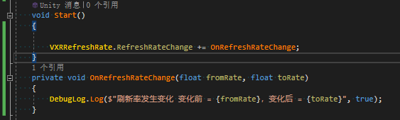

# 显示刷新率

> 显示刷指屏幕每秒刷新次数。更高的刷新率可实现更高的帧速率、更明亮的输出以及更高的色彩清晰度。
> 当前设备默认刷新率为90Hz


## 获取支持刷新率
当前设备仅支持90Hz
要查看当前设备支持刷新率
```CSharp
float[] rates = VXRRefreshRate.GetRefreshRates();
```

## 设置刷新率
应用可以根据需求更改刷新率，若设置刷新率设备不支持，则设置无效
```CSharp
// 获取刷新率
float rate = VXRRefreshRate.GetRefreshRate();
// 设置刷新率
VXRRefreshRate.SetRefreshRate(90f);
```


## 注意
设置刷新率仅支持有效的分辨率

## 刷新率变化
当刷新率发生变化时，可以通过监听刷新率变化事件处理相关逻辑


<details>
<summary>
引用
</summary>

* [VXRRefreshRate](../../../API/XR/Operation/RefreshRate/VXRRefreshRate.md)
</details>