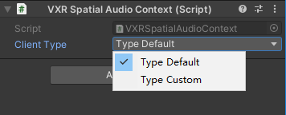
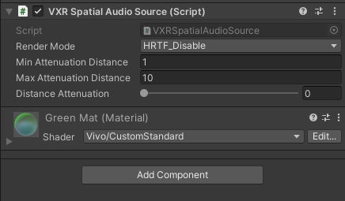
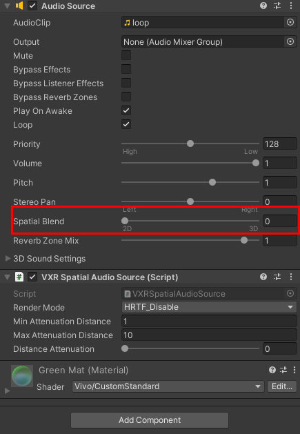
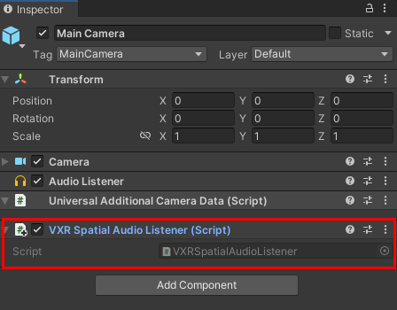
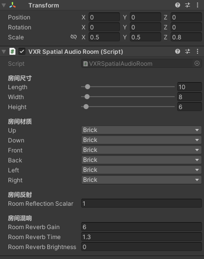

# 空间音频

相较于传统立体声技术，空间音频渲染赋予声音更强大的空间感，可覆盖听者四周的所有声源，包括水平面上的声源和上下方的声源。此外，空间音频场景下，用户感知到的声音变化更加贴合实际，例如：当用户靠近声源时，音量将会变大。

## 前置条件

SDK版本在0.7.0 以上支持空间音频

## 脚本参数说明

### [VXRSpatialAudioContext](../../../API/XR/Operation/SpatialAudio/VXRSpatialAudioContext.md)
用于设置空间音频实现实例

* Client Type：用于设置空间音频实现实例
  * Type Default : vivo实现的空间音频实例
  * Type Custom ：开发者[自定义的空间音](#自定义空间音频)实例

### [VXRSpatialAudioSource](../../../API/XR/Operation/SpatialAudio/VXRSpatialAudioSource.md)
用于设置声源相关参数，包括基础参数、距离衰减参数。

|参数|说明|
|---|---|
|Render Mode | 音源渲染模式   - HRTF_Disable 禁用基于HRTF的渲染   - HRTF_Ambisonics_8 基于HRTF的渲染，使用一阶Ambisonics， 8个扬声器的虚拟阵列   - HRTF_Ambisonics_12 基于HRTF的渲染，二阶Ambisonics，12个扬声器的虚拟阵列   - HRTF_Ambisonics_26 基于HRTF的渲染，三阶Ambisonics，26个扬声器的虚拟阵列
|minAttenuationDistance | 用于设置声源音量的最近衰减距离。当听者与声源的距离小于 Min Attenuation Distance 时，声源音量不会随着距离的变化而衰减，即：衰减 = 0dB。 注：**请勿输入大于 Max Attenuation Distance 的数值，否则会形成反常的音量衰减曲线**。
|distanceAttenuation | 用于设置声源音量的最远衰减距离。当听者与声源的距离大于 Max Attenuation Range 时，声源音量不会再随着距离的增长而衰减。  注：**请勿输入小于 Min Attenuation Distance 的数值，否则会形成反常的音量衰减曲线**。

### [VXRSpatialAudioListener](../../../API/XR/Operation/SpatialAudio/VXRSpatialAudioListener.md)
用于指定空间音频渲染的结果，即双耳音频信号的输出方式。
注：当前无配置项

## 自由声场

自由声场（Free Field）指仅模拟声源位置，同时忽略所有环境声学现象的声场。按以下步骤配置自由声场：
1. 在 Unity 编辑器中打开你的项目。
2. 从上方菜单栏处，选择 GameObject，创建一个游戏对象。
3. 在 Hierarchy 窗口中，选中该游戏对象。Inspector 窗口中将展示该对象挂载的脚本和组件。
4. 点击 Inspector 窗口底部的 Add Component 按钮。
5. 为该游戏对象添加 [VXRSpatialAudioContext](../../../API/XR/Operation/SpatialAudio/VXRSpatialAudioContext.md) 脚本。
    

    * Client Type：用于设置空间音频实现实例
       * Type Default : vivo实现的空间音频实例
       * Type Custom ：开发者[自定义的空间音](#自定义空间音频)频实例  

6. 按需配置 Client Type ，设置空间音频实现方案。
7. 创建另一个游戏对象。
   |提示   为了更好的视觉效果，建议创建一个球体（Sphere）。|
   |--|
8. 为该游戏对象添加 [VXRSpatialAudioSource](../../../API/XR/Operation/SpatialAudio/VXRSpatialAudioSource.md) 脚本。添加后：Unity的Audio Source组件将被自动添加至该游戏对象。建议将 Spatial Blend 的值保持为 0 。
  

9.  找到挂载Unity的Audio Listener组件的音频接收对象，一般为 Main Camera。为该对象添加 [VXRSpatialAudioListener](../../../API/XR/Operation/SpatialAudio/VXRSpatialAudioListener.md) 脚本。
  

## 静态房间

按照以上步骤设置[自由声场](#自由声场)后，可为头显添加静态房间。
**注：房间模型中心点固定位头显位置**

1. 从上方菜单栏处，选择 GameObject，创建一个游戏对象。
2. 在 Hierarchy 窗口中，选中该游戏对象。Inspector 窗口中将展示该对象挂载的脚本和组件。
3. 点击 Inspector 窗口底部的 Add Component 按钮。
4. 为该游戏对象添加 [VXRSpatialAudioRoom](../../../API/XR/Operation/SpatialAudio/VXRSpatialAudioRoom.md) 脚本。分别设置房间尺寸，六面墙预设材质，房间反射与混响参数。
  

## 已知问题

1. 音频在头显上扬声器有杂音，重启设备首次运行无杂音，后续播放会有杂音。
2. 头显通过USB连接PC后，通过scrcpy.exe打开后，会默认使用PC的扬声器播放音效。

## 引用

* [VXRSpatialAudio](../../../API/XR/Operation/SpatialAudio/VXRSpatialAudio.md)
* [VXRSpatialAudioContext](../../../API/XR/Operation/SpatialAudio/VXRSpatialAudioContext.md)
* [VXRSpatialAudioSource](../../../API/XR/Operation/SpatialAudio/VXRSpatialAudioSource.md)
* [VXRSpatialAudioListener](../../../API/XR/Operation/SpatialAudio/VXRSpatialAudioListener.md)
* [VXRSpatialAudioRoom](../../../API/XR/Operation/SpatialAudio/VXRSpatialAudioRoom.md)
* [IVXRSpatialAudio](../../../API/XR/Operation/SpatialAudio/IVXRSpatialAudio.md)
