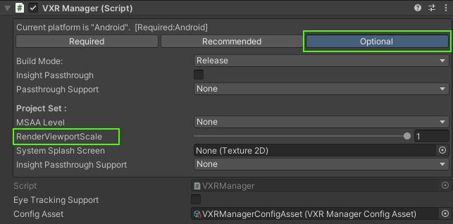

# 1.编辑器状态设置视口缩放

>> 需要在VXRManager编辑器界面Inspector上设置RenderViewportScale，并且需要开启Vulkan 图像API。

# 示例

 
    
2.运行时设置视口缩放

>> 运行时修改MSAA需要使用接口 VXRCommon.RenderViewportScale。

# 示例
>   VXRCommon.RenderViewportScale = 0.8f;

引用

* [VXRCommon](../../../API/XR/Base/VXRCommon.md)

