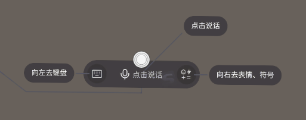
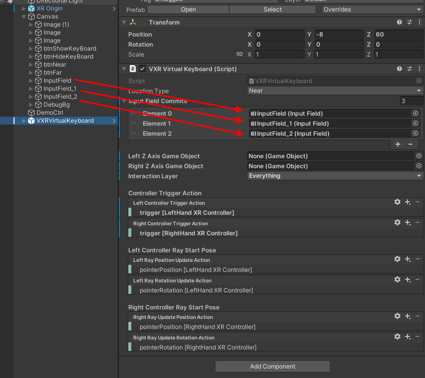
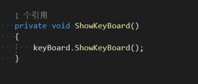

# 虚拟键盘

> 虚拟键盘可以直接在应用程序中快捷的进行文字输入，提供拟真的打字体验。
> 
> 该键盘使用光线投射交互，即使用手柄位置上某个物体向前方发出的射线和键盘进行交互。
>
> 虚拟键盘集成了搜狗输入法，支持全键盘、拼音九键、中文简体繁体切换、输入振动、音效和语音输入等功能。

## 虚拟键盘组件和预制体
* 组件  
Vivo XR Plugin 提供了 VXRVirtualKeyboard 组件实现虚拟键盘相关功能，组件面板如下：  

* 预制  
开发者使用虚拟键盘时只需将预制体 VXRVirtualKeyboard.prefab 拖拽入场景中，对组件进行相关配置后即可使用，预制件结构和预览如下：

预制体路径：../Runtime/XR/Operation/VXRVirtualKeyboard/prefab/VXRVirtualKeyboard.prefab。  

### 显示位置
 虚拟键盘提供两种预设显示位置和自定义移动位置，具体说明如下：  
 1、近场显示：键盘尺寸小，显示距离近。  
 2、远场显示：键盘尺寸大，显示距离远。  
 3、自定义移动：键盘显示为当前放置位置，可通过移动交互点抓取键盘进行移动。

### 文本显示方式
 虚拟键盘提供两种文本显示方式，具体说明如下：
 显示方式 | 描述
------ | ------
 InputField | VXRVirtualKeyboard 组件上绑定 Unity InputField，键盘输入文字时，InputFiled 上同步显示输入信息。
 输入法文本事件响应 | VXRVirtualKeyboard 组件提供了 RegisterCommitTextListener 接口用于注册输入法文本事件监听，在监听响应时获取到文本信息，可自由的显示到任何可以显示文本的地方。  

### 配置交互射线
虚拟键盘使用射线交互，需要指定一个z轴向前的物体来作为射线发射源，例如手柄下用于表示射线的可视化物体。

### 配置InputSystem Asset
虚拟键盘的控制器输入配置使用 UnityEngine.InputSystem.InputActionAsset，可在面板上指定当前项目中所使用的 InputActionAsset，例如 OpenXR Plugin Sample 中 Controller 下的 ControllerSampleActions.inputactions。

### 配置射线输入按键Action
虚拟键盘输入响应的控制器按键选项，可在InputActionAsset下选择想要的 InputActionReference。例如在Samples的示例Common Assets 中有提供DemoActions.inputactions 文件，可以使用它里面的 LeftHand/Trigger 和 RightHand/Trigger。  

### 语音输入及其快捷键

虚拟键盘点击语音输入的选项时，会打开语音输入界面，手柄控制器侧面会出现语音的快捷键提示面板。快捷键提示面板分为两种模式，一种普通模式，一种编辑模式。
普通模式下可以使用摇杆左移进入键盘的中英文输入界面，右移进入键盘的表情输入界面。按下摇杆按钮，会开启录音。界面如下图：

当进行一次语音输入后，提示面板会自动从普通模式切换到编辑模式。
编辑模式下，包含普通模式的摇杆的快捷输入，同时增加了两种操作，摇杆上移删除当前输入的内容，摇杆下移，实现回车功能。界面如下图：

## 使用虚拟键盘
**前置条件**  
* 使用虚拟键盘时请确保设备支持并安装了搜狗输入法。  

**第一步 虚拟键盘配置**
1. 使用虚拟键盘预制体，在Project面板搜索框中输入 VXRVirtualKeyboard，找到 VXRVirtualKeyboard.prefab 并拖入你的 XR 场景中，调整到合适的位置，如下图：  
     

2. 选择默认显示位置，组件提供了 Near（近场显示）、Far（远场显示）、Cumtom（自定义移动）三种位置类型，如下图：  

   

3. 指定文本输入框，创建一个或多个 InputField，将其拖拽到 VXRVirtualKeyboard 组件 Inspector 面板上 InputFieldCommits 列表中，如下图：

4. 选择射线发射源，推荐选择手柄下用于表示射线的物体，如下图：

也可以不设置射线发射源。如果不设置，会默认使用下方 Controller Ray Start Pose 提供的射线方向和角度的数据。

5. 设置射线的响应层。默认所有Layer的物体都会被射线遮挡，可根据情况进行调整。
   
6. 设置控制器的输入事件。默认已经设置好了，如果需要自定义，可以参考官方文档进行设置。文档链接：https://docs.unity3d.com/Packages/com.unity.inputsystem@1.1/manual/ActionBindings.html
   
   Left Controller Trigger Action：左控制器确认事件
   Right Controller Trigger Action：左控制器确认事件
   Left Ray Position Update Action：左控制器射线的起始点位置
   Left Ray Rotation Update Action：左控制器射线的起始点角度
   Right Ray Position Update Action：右控制器射线的起始点位置
   Right Ray Rotation Update Action：右控制器射线的起始点角度

**第二步 虚拟键盘使用**  

1. 显示，虚拟键盘提供了两种显示方式
* 在场景中点击 VXRVirtualKeyboard 组件绑定的 InputField 输入框显示虚拟键。
* VXRVirtualKeyboard 提供了 ShowKeyBoard 接口显示虚拟键盘，你可以灵活的使用这个接口，在需要的时候调用将键盘显示出来，使用方法如下图：  
   
   
2. 关闭，虚拟键盘提供了两种关闭方式
* 可点击虚拟键盘左下角下箭头标识关闭键盘，如下图：

* VXRVirtualKeyboard 提供了 HideKeyBoard 接口关闭虚拟键盘，你可以灵活的使用这个接口，在需要的时候调用将键盘关闭，使用方法如下图：  

3. 输入法事件监听，VXRVirtualKeyboard 组件提供的输入法事件如下：  
   * 文本提交事件  
      添加监听：AddCommitTextListener  
      移除监听：RemoveCommitTextListener
   * 退格键事件  
      添加监听：AddBackSpaceListener  
      移除监听：RemoveBackSpaceListener
   * 回车键事件  
      添加监听：AddEnterListener  
      移除监听：RemoveEnterListener
   * 键盘显示事件 
      添加监听：AddShowListener  
      移除监听：RemoveShowListener
   * 键盘隐藏事件
      添加监听：AddHideListener  
      移除监听：RemoveHideListener
    * 语音输入开始
      添加监听：AddRecordStartListener  
      移除监听：RemoveRecordStartListener  
   * 语音输入结束  
      添加监听：AddRecordEndListener  
      移除监听：RemoveRecordEndListener 

    使用方法如下图：   
    

4. 改变推荐显示位置，虚拟键盘提供三种推荐位置模式，分别是 Far（远场显示）、Near（近场显示）和 Custom（自定义移动）。使用方法如下：
* 近场/远场 
    
  近场效果：  
   
  远场效果： 
   
* 自定义移动，用射线选中键盘下端白色移动交互控件，按住Trigger键，即可抓取键盘进行移动，如下图：  
 

5. 语音输入，点击虚拟键盘的语音输入图标，就会进入语音输入模式。

进入语音输入界面后，此时会出现语音的快捷键提示面板，默认为普通模式，显示在手柄的侧面，如下图：

摇杆左移，会回到键盘的中英文输入界面。摇杆右移会进入表情输入界面。
如果按下摇杆按钮，则会开启录音，如下图：

录音结束后，语音的快捷键提示面板会进入编辑模式，如下图：

相比普通模式，编辑模式还可以操作摇杆进行编辑，摇杆上移删除文字，摇杆下移回车换行。

### 虚拟键盘使用效果图
