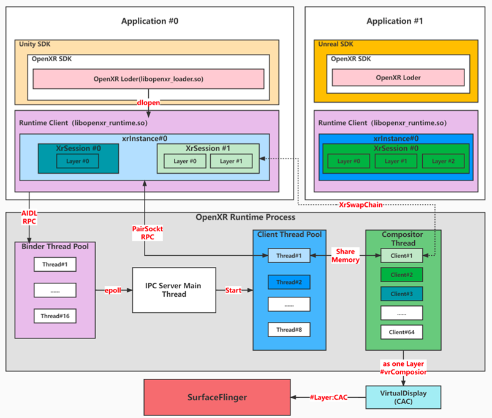

  
#折叠和链接示例

<details>
 <summary>
  第一章  数据展示
 </summary>
  
 * [1.1  在线链接跳转](https://www.baidu.com)
 * [1.2  定制 Grafana 首页](chapterF-01-Analytics-Platform/F-1.2-change-the-default-home-dashboard.md)
 * [小结](chapterF-01-Analytics-Platform/END.md)
  
     <details>
     <summary>
        第一章  数据展示
     </summary>

     * [1.1  什么是 Grafana](https://www.baidu.com)
     * [1.2  定制 Grafana 首页](chapterF-01-Analytics-Platform/F-1.2-change-the-default-home-dashboard.md)
     * [1.3折叠本地链接展示](跳转到的目标.md)

         <details>
         <summary>
              第一章  数据展示
         </summary>

         * [1.1  什么是 Grafana](https://www.baidu.com)
         * [1.2  定制 Grafana 首页](chapterF-01-Analytics-Platform/F-1.2-change-the-default-home-dashboard.md)
         * [小结](chapterF-01-Analytics-Platform/END.md)
         </details>
     </details>
</details>
  
  
# 代码块示例
```
echo "Hello"
public static void sayHello(){
  System.out.println("hello world")
}
```
  
# 表格示例1

项目     | Value |ext
-------- | ----- | --------
电脑  | $1600 |
手机  | $12|
导管  | $1|

# 插入表格示例2
<table>
 <tr><td>1</td><td>1</td><td>1</td><td>dsadasdsadasd1</td></tr>
  <tr><td>1</td><td>1</td><td>1</td><td>1</td></tr>
</table>
  
  

# 文档层级示例
> Dorothy followed her through many of the beautiful rooms in her castle.
>> The Witch bade her clean the pots and kettles and sweep the floor and keep the fire fed with wood.


# 列表展示
1. First item
2. Second item
3. Third item
4. Fourth item


# 列表层级示例
- First item
- Second item
- Third item
    - Indented item
    - Indented item
- Fourth ite


# 示例图片展示
图片插入展示



# 视频插入展示
<video src="res/record.mp4" controls title="Title"></video>


#字体风格示例
*斜体文本*
_斜体文本_
**粗体文本**
__粗体文本__
***粗斜体文本***
___粗斜体文本___
~~删除文本~~